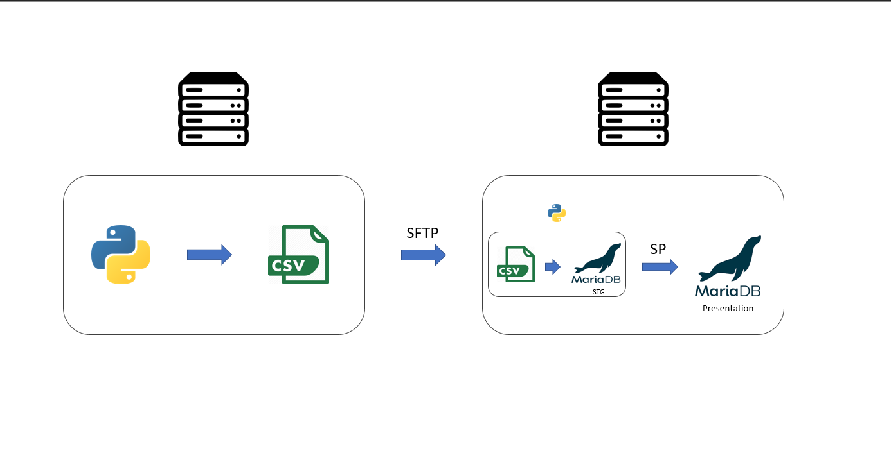

# SFTP, BashScripting and MariaDB

## Overview and Objective
Having two linux machines, one is importing data as part of its daily processes, the other stores (leveraging MariaDb) a variety of data needed for analytical purposes. Part of the data imported has become of interest and we are asked to create a DB object to on the storage machine and populate it. 

## Pipeline overview
The pipeline loads data incrementally updating the last 7 days. Operations are performed through **cronjobs** triggering **.sh scripts** which orchestrate the various tasks including directory/folder management.
It unfolds as follows:

1) OLTP machine downloads data periodically into CSV
2) OLAP machine gets CSV through SFTP
3) OLAP machine runs Python scripts performing:
    - basic data manipulation with **pandas** to prepare for import in DB
    - generation of processed CSV
    - connection to MariaDB and instruction to load data and execute relevant Stored Procedures
4) In Mariadb, data is loaded in staging table and UPSERTed in presentation table by SPs.

## Contents
You will find:
- `oltp_machine` folder with:
    - `scripts`: folder with scripts
    - `data`: data folder
- `olap_machine` folder with:
    - `scripts`: folder with scripts
    - `config`: folder with configs to be edited
    - `sql`: folder with sql scripts
    - `logs`: folder with logs

## How to use
Change config variables. **Do not** end paths with escape `/` character. 

Configure sftp/ssh with OLAP machine with public/privete keys.\
Set up cronjobs passing config.txt to exec_pipeline.sh command

## Dependencies
Python: pandas, yfinance, numpy

